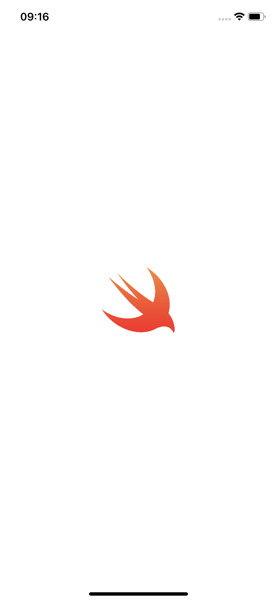
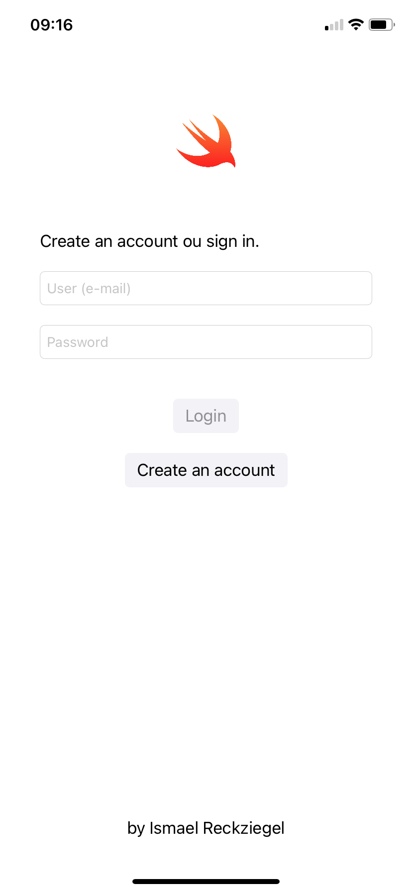
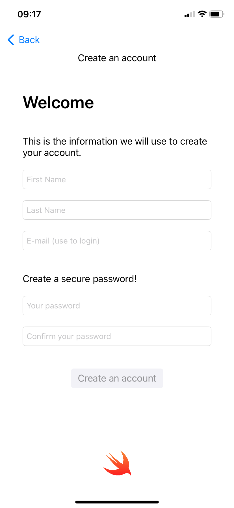
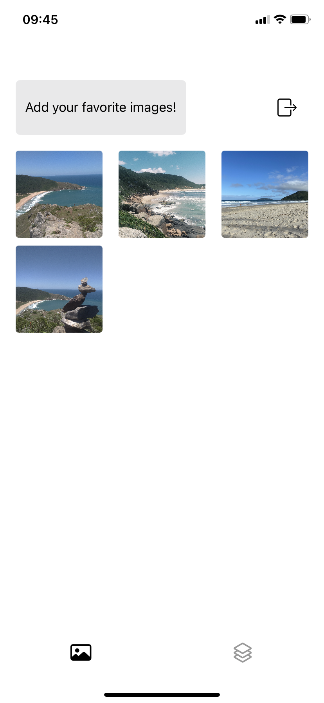
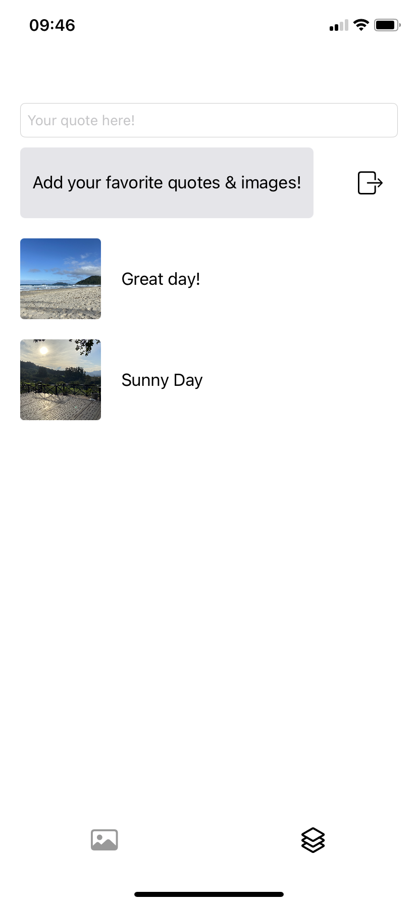

em edicão...

# Gallery StoryBoard 

## Sobre o projeto 
descrição e objetivo do projeto...

## Layout App

  
  
  

  
  

## Tecnologias utilizadas

- Swift
- UIKit

## Estrutura do projeto
sobre o seu desenvolvimento...

## Autor

Ismael Reckziegel

https://www.linkedin.com/in/ismaelrkz/
